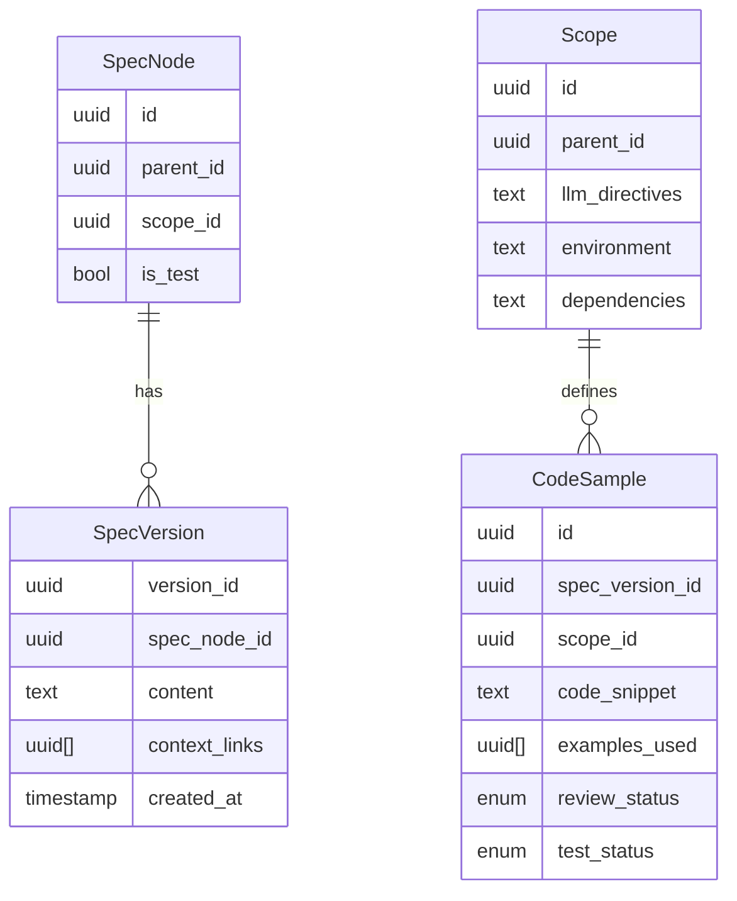

We are looking to create a literate programming tool where natural language specifications are the source of truth. The tool:
- organizes specs in a hierarchical structure
- organizes scopes/reference implementations in a DAG where each branch/fork represents a major design/archictecture decision (e.g. the "Python" node will have "Python with Flask" and "Python with Django" child nodes)
- links spec nodes to impl nodes with objects representing specific code samples or commits
- supports automatic reimplementation with human-reviewed LLM assistance (e.g. if we want to rewrite the project in Rust, the tool will automatically pull samples from the other reference implementations)
- keeps track of the overall project structure of each implementation (thus allowing the system prompt to already contain the necessary context for the LLM to generate code)
- keeps track of common operations, both on the code, e.g. "this is how you add a new page to user settings," and on the project, e.g. "this is how you build and deploy the project"

Details:

The specs are where all the high-signal human-created bits live. The LLM-generated code samples contain a lot of noise and will not be used as the source of truth. The specs should be written in a way that is easy for humans to read and understand, but also structured enough for an LLM to parse and use them as a basis for code generation.

The smallest atomic unit for a spec node should be a specific requirement for either how something should function or how something should be implemented. Any spec node can be referenced from any other spec node, but such references should be made very explicit, and this tool should keep track of that. We should have a stable ID for each spec node so that we can track how a requirement evolved over time, but we should also have version-specific IDs for each spec node.

There should be an arbitrary number of layers in this tree. A user should start out with a single node (e.g. "new Python script") and more nodes should be added and nested under that as requirements grow. Tree refactoring should be possible; it should be easy for users to reorganize the tree, or to split/merge nodes.

The full extent of relationship types between spec nodes is unclear at this prototyping stage. We should allow for a generic relationship that simply marks that information in one node is necessary for fully understanding the context of another one.

Nodes should also be colored according to whether they contain requirements referring to the spec (so requirements that should be satisfied for all implementations) or whether they contain implementation-specific requirements (which means e.g. Python-specific nodes would be hidden from JavaScript-specific nodes when the LLM tries to create a new JavaScript implementation of the project). Nodes should also have another flag that marks them as specifying requirements for test behavior, runtime behavior, or infrastructure behavior.

The tool is meant for consumption by both humans (who define the spec) and LLMs (who implement and reimplement the human definitions based existing code samples).

Content structure should be free-form Markdown with optional structured fields. At least one of these fields will be a marker for whether it's a spec or impl node. Another field will be the list of which other nodes need to be included for context.

Nodes should have pure scope. Scopes themselves form a hierarchy (e.g. the "Python with Django" and "Python with Flask" scopes branching off of the "Python" scope), where the leaf nodes are the reference implementations.

LLM-specific directives should be supported and documented in the reference implementation nodes. These can be things related to how the LLM should generate code, or how the system architecture for this particular implementation is set up.

Scopes should be trees and inheritance should be allowed. Child attributes always override parent ones. Code samples should not be linked to multiple scopes -- a reimplementation of the same requirement can maybe even produce the same exact code, but the code samples should still be separate objects. If one code sample was used to generate another code sample, that should be documented.

The LLM should be exposed to all ancestor scopes of the current reference implementation. Think of each scope node as a fork or a branching path where one major software design/architecture decision was made instead of another. Each decision builds on the context of all decisions before it, and the LLM should be aware of these decisions.

New spec versions should be defined by users. When a Spec Node (A) references another (B) via `context_links`, both the stable ID of B and also the specific latest version of B when the reference was made should be recorded. The latest spec version is always the one linked-to by default. When looking for a usable code sample, we will grab the most recent one available and note any changes made to the spec since. We will ask the LLM if manual re-validation of dependent spec nodes is needed after a spec change. If so, we will prompt the user for a review.

New scopes are always defined by users. These represent a fork of the project, and will be lightweight and rare.

When a user wants to generate code for a new scope, we auto-gather specs with user review and confirmation before submission.

Automated checks should be made use of as much as possible. Automatically compile and test. Retry for up to N times, and then flag for user review if it still fails. This means that there should be an additional flag for whether compile checks/tests pass, on top of the human-reviewed one.

The UI should inform users of outdated code samples.

Dev environment setup will occur by having the LLM install the relevant dev tooling and dependencies on the commandline. The relevant setup steps should be recorded as well, along with any user assistance. Error logs should definitely be put in.

There will be spec nodes specifically for testing. Spec nodes will cover any and all human-generated desires about the codebase, and that includes tests in the codebase. There should be another flag for whether a spec node is a test spec node or a regular runtime requirement spec.


Below is a comprehensive, developer-ready specification.

### **Literate Programming Tool: Developer-Ready Specification**  

---

#### **1. System Overview**  
A desktop application that treats natural language specifications as the source of truth. It enables:  
- Hierarchical organization of specs with versioning.  
- Multi-implementation support via scopes (reference implementations).  
- LLM-driven code generation with automated testing.  
- Traceability between specs, implementations, and code samples.  

**Target Users**: Developers, Technical Writers.  

---

#### **2. Core Requirements**  
##### **2.1. Structural Hierarchy**  
| **Component**       | **Requirements**                                                                 |  
|----------------------|----------------------------------------------------------------------------------|  
| **Spec Nodes**       | - Arbitrary nesting (root → children) with stable UUIDs<br>- `is_test` flag for test-related specs<br>- `scope_id` (universal or implementation-specific) |  
| **Spec Versions**    | - Immutable, manually committed<br>- Pinned `context_links` to specific versions<br>- Markdown content + metadata |  
| **Scopes**           | - Tree structure (e.g., `Python` → `Python/Django`)<br>- Attributes: `name`, `parent_id`, `llm_directives`, `environment`, `dependencies`<br>- Child attributes override parents |  
| **Code Samples**     | - 1:1 link to a Spec Version + Scope<br>- Metadata: `review_status`, `test_status`, `examples_used` (lineage)<br>- Code snippet storage |  

##### **2.2. Workflows**  
| **Workflow**         | **Steps**                                                                        |  
|----------------------|----------------------------------------------------------------------------------|  
| **Spec Authoring**   | 1. Create/edit nodes in desktop editor<br>2. Commit versions manually<br>3. Define `context_links` (pinned versions) |  
| **Scope Setup**      | 1. Create scope with parent<br>2. Inherit/override attributes (e.g., `llm_directives`)<br>3. Define `environment`/`dependencies` |  
| **Reimplementation** | 1. User selects target scope<br>2. System gathers: Universal specs + ancestor scopes<br>3. User reviews input<br>4. LLM generates code<br>5. CLI-based testing (3 retries)<br>6. Create `Code Sample` with status |  

##### **2.3. LLM Integration**  
- **Partial Prompt Structure**:  
  ```markdown
  ## PROJECT ARCHITECTURE:
  {{Ancestor Scope + Ancestor Directives}}
  ## REQUIREMENT:
  {{Spec Content}}
  ## ADDITIONAL CONTEXT:
  {{Pinned Context Links}}
  ## REFERENCE EXAMPLES:  
  ```<Code Language>  
  {{Code Snippet}}
  {{Diff between the context during reference and now}}
  ```

- **Output Handling**:  
  - Auto-create `Code Sample` with `review_status="generated"`  

---

#### **3. Architecture**  
##### **3.1. Data Model**  


##### **3.2. System Components**  
| **Component**       | **Responsibilities**                                                                 |  
|----------------------|--------------------------------------------------------------------------------------|  
| **Editor Core**      | Node/version CRUD, tree visualization, scope management                              |  
| **LLM Gateway**      | Prompt assembly, streaming API calls (optional), secrets redaction (string search-based)                |  
| **Local Test Runner**      | CLI execution for dependency install (`pip/npm`), compilation, test execution        |  
| **Lineage Tracker**  | Manages `examples_used` and version diffing                                          |  

---

#### **4. Error Handling & Edge Cases**  
| **Scenario**                          | **Handling Strategy**                                                                 |  
|---------------------------------------|---------------------------------------------------------------------------------------|  
| **LLM Generation Failure**            | - Retry ×2<br>- Return error: "LLM_TIMEOUT" or "LLM_INVALID_OUTPUT"                   |  
| **Test Failure**                      | - Retry ×3 with error logs<br>- Final status: `test_status="failed"`                  |  
| **Outdated Code Sample Reference**    | - Warn in UI: "Reference sample older than current spec"<br>- Include diff in header  |  
| **Circular Spec Links**               | - Detect during version commit<br>- Reject: "CIRCULAR_DEPENDENCY"                     |  
| **Missing Scope Attributes**          | - Fallback to nearest parent’s attributes                                             |  

---

#### **5. Testing Plan**  
##### **5.1. Unit Tests**  
| **Module**           | **Test Cases**                                                                        |  
|----------------------|---------------------------------------------------------------------------------------|  
| **Spec Versioning**  | - Pinned `context_links` resolve correctly<br>- Immutability after commit             |  
| **Scope Inheritance**| - Child overrides parent directives<br>- Empty attributes inherit from parent          |  
| **Prompt Builder**   | - Secrets redaction (e.g., API keys)<br>- Correct ancestor scope inclusion            |  

##### **5.2. Integration Tests**  
| **Workflow**         | **Validation**                                                                        |  
|----------------------|---------------------------------------------------------------------------------------|  
| **Reimplementation** | - End-to-end: Spec → LLM → Test<br>- CLI commands execute in correct order            |  
| **Code Sample Lineage** | - `examples_used` traceable to source<br>- Header includes accurate diff summary  |  

##### **5.3. End-to-End Tests**  
1. **Setup**:  
   - Create scope tree: `Python` → `Python/FastAPI`  
   - Define universal spec: "User authentication"  
2. **Generate**:  
   - Trigger reimplementation for `Python/FastAPI`  
   - Verify:  
     - Generated code includes ancestor directives  
     - Tests run via CLI (`pytest`)  
     - `Code Sample` created with `test_status="passed"`  
3. **Failure Case**:  
   - Introduce breaking spec change  
   - Verify outdated code samples flagged in diff  

---

#### **6. API Specifications**  
##### **6.1. REST Endpoints**  
**`POST /generate`**  
```json  
Request:  
{  
  "target_scope_id": "uuid",  
  "spec_version_ids": ["uuid1", "uuid2"]  
}  

Response (Streaming):  
{  
  "status": "generating|testing|done",  
  "output": "code_snippet || error_logs",  
  "test_status": "passed|failed"  
}  
```  

##### **6.2. Data Contracts**  
**Code Sample Object**:  
```typescript  
interface CodeSample {  
  id: string;  
  spec_version_id: string;  
  scope_id: string;  
  code_snippet: string;  // todo: make structured data type
  commit_hash: string;
  examples_used: string[];  // ids to other Code Samples
  review_status: "generated" | "human_reviewed";  
  checks: "unchecked" | "passed" | "failed";  
}  
```  

---

#### **7. Security & Compliance**  
- **Secrets Handling**: String search redaction (e.g., for API keys and passwords).  
- **LLM Security**: Optional user confirmation before sending data to external APIs.  

---

#### **8. Deliverables**  
**Desktop Editor**:  
   - Golang frontend
   - Tree-based navigation, scope/version management  

---

**Next Steps for Developer**:  
1. Implement data models (SQLite/local JSON).
2. Build editor UI.
3. Integrate LLM API gateway (e.g., OpenAI).
4. Develop CLI compile/test runner with retry logic.  
