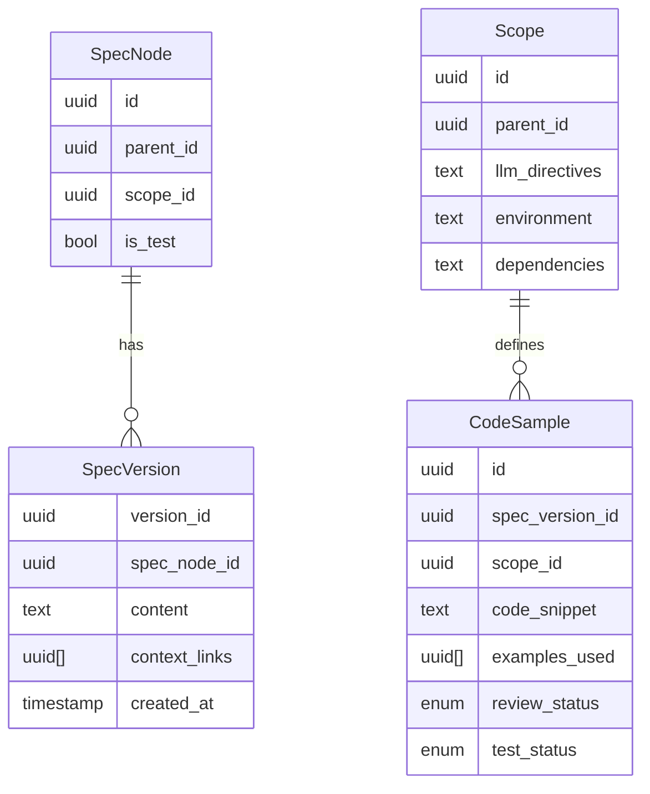

### **Literate Programming Tool: Developer-Ready Specification**  

---

#### **1. System Overview**  
A desktop application that treats natural language specifications as the source of truth. It enables:  
- Hierarchical organization of specs with versioning.  
- Multi-implementation support via scopes (reference implementations).  
- LLM-driven code generation with automated testing.  
- Traceability between specs, implementations, and code samples.  

**Target Users**: Developers, Technical Writers.  

---

#### **2. Core Requirements**  
##### **2.1. Structural Hierarchy**  
| **Component**       | **Requirements**                                                                 |  
|----------------------|----------------------------------------------------------------------------------|  
| **Spec Nodes**       | - Arbitrary nesting (root → children) with stable UUIDs<br>- `is_test` flag for test-related specs<br>- `scope_id` (universal or implementation-specific) |  
| **Spec Versions**    | - Immutable, manually committed<br>- Pinned `context_links` to specific versions<br>- Markdown content + metadata |  
| **Scopes**           | - Tree structure (e.g., `Python` → `Python/Django`)<br>- Attributes: `name`, `parent_id`, `llm_directives`, `environment`, `dependencies`<br>- Child attributes override parents |  
| **Code Samples**     | - 1:1 link to a Spec Version + Scope<br>- Metadata: `review_status`, `test_status`, `examples_used` (lineage)<br>- Code snippet storage |  

##### **2.2. Workflows**  
| **Workflow**         | **Steps**                                                                        |  
|----------------------|----------------------------------------------------------------------------------|  
| **Spec Authoring**   | 1. Create/edit nodes in desktop editor<br>2. Commit versions manually<br>3. Define `context_links` (pinned versions) |  
| **Scope Setup**      | 1. Create scope with parent<br>2. Inherit/override attributes (e.g., `llm_directives`)<br>3. Define `environment`/`dependencies` |  
| **Reimplementation** | 1. User selects target scope<br>2. System gathers: Universal specs + ancestor scopes<br>3. User reviews input<br>4. LLM generates code<br>5. CLI-based testing (3 retries)<br>6. Create `Code Sample` with status |  

##### **2.3. LLM Integration**  
- **Partial Prompt Structure**:  
  ```markdown
  ## PROJECT ARCHITECTURE:
  {{Ancestor Scope + Ancestor Directives}}
  ## REQUIREMENT:
  {{Spec Content}}
  ## ADDITIONAL CONTEXT:
  {{Pinned Context Links}}
  ## REFERENCE EXAMPLES:  
  ```<Code Language>  
  {{Code Snippet}}
  {{Diff between the context during reference and now}}
  ```

- **Output Handling**:  
  - Auto-create `Code Sample` with `review_status="generated"`  

---

#### **3. Architecture**  
##### **3.1. Data Model**  


##### **3.2. System Components**  
| **Component**       | **Responsibilities**                                                                 |  
|----------------------|--------------------------------------------------------------------------------------|  
| **Editor Core**      | Node/version CRUD, tree visualization, scope management                              |  
| **LLM Gateway**      | Prompt assembly, streaming API calls (optional), secrets redaction (string search-based)                |  
| **Local Test Runner**      | CLI execution for dependency install (`pip/npm`), compilation, test execution        |  
| **Lineage Tracker**  | Manages `examples_used` and version diffing                                          |  

---

#### **4. Error Handling & Edge Cases**  
| **Scenario**                          | **Handling Strategy**                                                                 |  
|---------------------------------------|---------------------------------------------------------------------------------------|  
| **LLM Generation Failure**            | - Retry ×2<br>- Return error: "LLM_TIMEOUT" or "LLM_INVALID_OUTPUT"                   |  
| **Test Failure**                      | - Retry ×3 with error logs<br>- Final status: `test_status="failed"`                  |  
| **Outdated Code Sample Reference**    | - Warn in UI: "Reference sample older than current spec"<br>- Include diff in header  |  
| **Circular Spec Links**               | - Detect during version commit<br>- Reject: "CIRCULAR_DEPENDENCY"                     |  
| **Missing Scope Attributes**          | - Fallback to nearest parent’s attributes                                             |  

---

#### **5. Testing Plan**  
##### **5.1. Unit Tests**  
| **Module**           | **Test Cases**                                                                        |  
|----------------------|---------------------------------------------------------------------------------------|  
| **Spec Versioning**  | - Pinned `context_links` resolve correctly<br>- Immutability after commit             |  
| **Scope Inheritance**| - Child overrides parent directives<br>- Empty attributes inherit from parent          |  
| **Prompt Builder**   | - Secrets redaction (e.g., API keys)<br>- Correct ancestor scope inclusion            |  

##### **5.2. Integration Tests**  
| **Workflow**         | **Validation**                                                                        |  
|----------------------|---------------------------------------------------------------------------------------|  
| **Reimplementation** | - End-to-end: Spec → LLM → Test<br>- CLI commands execute in correct order            |  
| **Code Sample Lineage** | - `examples_used` traceable to source<br>- Header includes accurate diff summary  |  

##### **5.3. End-to-End Tests**  
1. **Setup**:  
   - Create scope tree: `Python` → `Python/FastAPI`  
   - Define universal spec: "User authentication"  
2. **Generate**:  
   - Trigger reimplementation for `Python/FastAPI`  
   - Verify:  
     - Generated code includes ancestor directives  
     - Tests run via CLI (`pytest`)  
     - `Code Sample` created with `test_status="passed"`  
3. **Failure Case**:  
   - Introduce breaking spec change  
   - Verify outdated code samples flagged in diff  

---

#### **6. API Specifications**  
##### **6.1. REST Endpoints**  
**`POST /generate`**  
```json  
Request:  
{  
  "target_scope_id": "uuid",  
  "spec_version_ids": ["uuid1", "uuid2"]  
}  

Response (Streaming):  
{  
  "status": "generating|testing|done",  
  "output": "code_snippet || error_logs",  
  "test_status": "passed|failed"  
}  
```  

##### **6.2. Data Contracts**  
**Code Sample Object**:  
```typescript  
interface CodeSample {  
  id: string;  
  spec_version_id: string;  
  scope_id: string;  
  code_snippet: string;  // todo: make structured data type
  commit_hash: string;
  examples_used: string[];  // ids to other Code Samples
  review_status: "generated" | "human_reviewed";  
  checks: "unchecked" | "passed" | "failed";  
}  
```  

---

#### **7. Security & Compliance**  
- **Secrets Handling**: String search redaction (e.g., for API keys and passwords).  
- **LLM Security**: Optional user confirmation before sending data to external APIs.  

---

#### **8. Deliverables**  
**Desktop Editor**:  
   - Golang frontend
   - Tree-based navigation, scope/version management  

---

**Next Steps for Developer**:  
1. Implement data models (SQLite/local JSON).
2. Build editor UI.
3. Integrate LLM API gateway (e.g., OpenAI).
4. Develop CLI compile/test runner with retry logic.  
